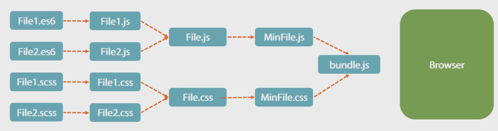

Webpack
=======

[pluralsight](https://app.pluralsight.com/library/courses/webpack-fundamentals/table-of-contents)

Why Build in web development
----------------------------

* Improve performance by 
    * combining files (multiple requests to a single request)
	* reduce code size by minifying files
	* Resolve File Order Dependencies 
	    * Through Module System
	* Transpile
	    * New feature of language
	* Linting

What is Webpack
---------------

* Specialized Task runner that 
    * Process input files into an output file
	     
	* Utilizes loader(s)
	* Webpack conventions
	    * Use NPM not bower
	    * Use a module system (AMD, common.js, or, ES6 module)

CLI
----

* Install

    ``` > npm i webpack -g ```

* Build

    ``` > webpack ./app.js bundle.js ```
	
    Check out [Webpack fundamental - Basic Builds with Webpack - CLI Basics] for an example


Config Files
------------

[!webpack.config.js]

```
module.exports = {
    Entry: "./app.js", 
	    Output: {
		    Filename: "bundle.js"
		}
	}
```

* Build with config file

``` > webpack ```
	
Watch mode
----

``` > Webpack --watch ```

Or,  with config file, 

```
module.exports = {
	entry: "./app.js", 
	output: {
		Filename: "bundle.js"
	}, 
	watch: true
}
```

``` > Webpack ```


Dev Server
----------

* Install

```> npm install webpack-dev-server -g```


* build

REWATCH "Watch Mode and the webpack dev server"

 


 

Loaders
----


Production Builds
-----------------


Once all these are done
=======================

1. setup webpack dev server with
- webdriver tests
- promise routines with debug setup
- for React Component creation
- for website development using react component (so, it reacts to the value of props)

2. Then open the site using webdriver (so use webdriver instead of browser)

